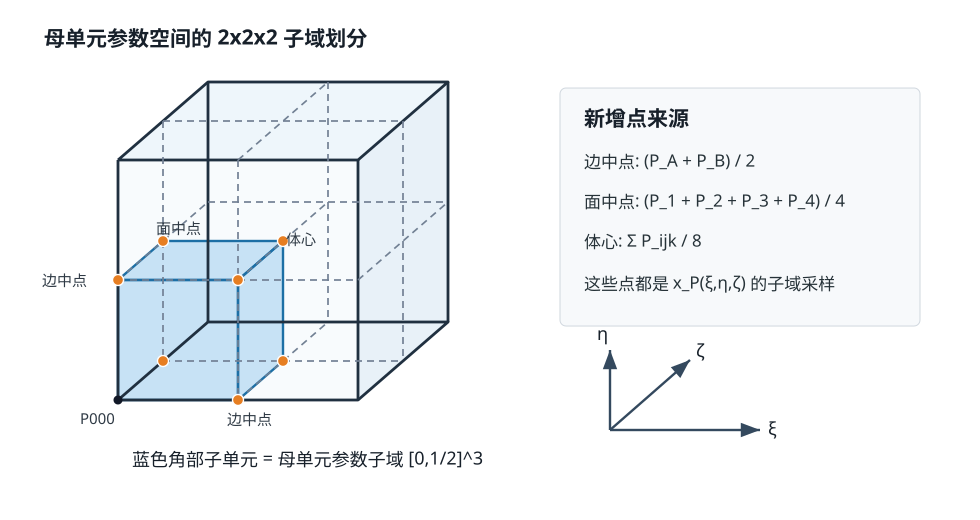
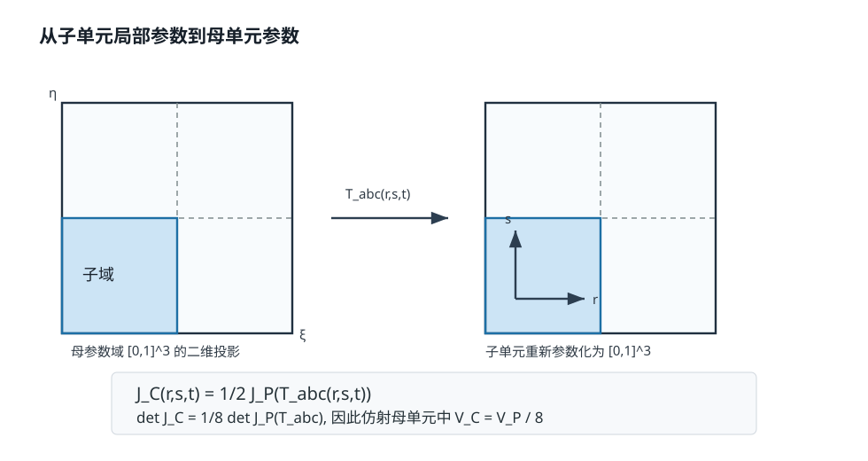
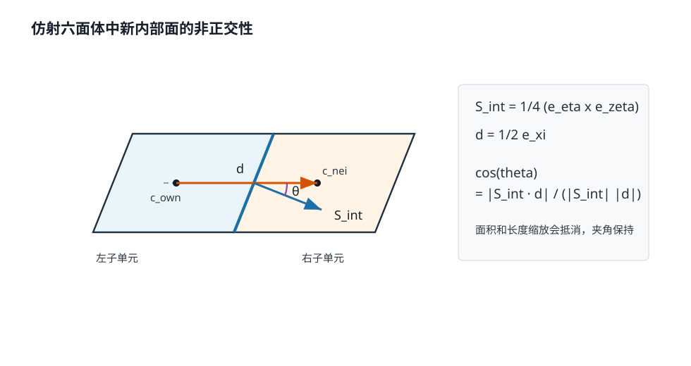
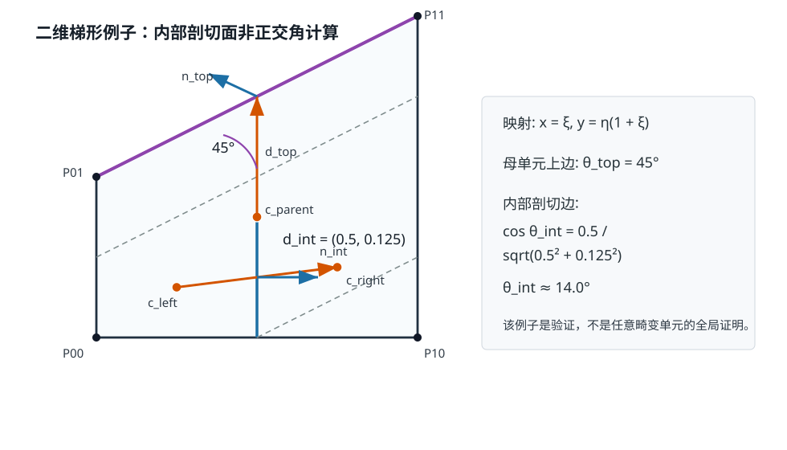

# AMR 线性插值下子网格质量与母网格质量的关系

## 0. 核查结论

原始推导的大方向是对的：本代码的 2x2x2 六面体加密点（边中点、面中点、体心）确实等价于在母六面体三线性参数映射上取子域。因此，体积、Jacobian 和局部纵横比可以严格推导。

需要修正的是结论强度：

1. 对**仿射六面体**（平行六面体、直六面体都属于此类），体积缩放、纵横比、方向夹角、新增内部面的非正交性、新增内部面的偏斜度都可以严格保持或严格为零。
2. 对**一般三线性六面体**，可以严格证明“子单元是母单元参数子域”，但不能对任意强畸变六面体严格宣称所有 `checkMesh` 指标都不超过母单元最大值。
3. 对通过 `checkMesh` 的常规 CFD 六面体，如果母单元 Jacobian 在单元内部变化平缓，则子单元质量与母单元同量级，线性插值加密本身不会引入新的几何畸变机制。

因此，论文或说明书中建议使用如下表述：

> 对仿射六面体，线性 2x2x2 加密严格保持形状质量；对常规小翘曲三线性六面体，子单元质量由母单元局部 Jacobian 控制，通常不产生显著质量恶化。实际计算仍需配合 `checkMesh`、2:1 加密约束、最大加密层数以及最小体积/边长下限。

---

## 1. 母单元三线性映射

设母六面体 8 个角点为

$$
P_{000}, P_{100}, P_{010}, P_{110},
P_{001}, P_{101}, P_{011}, P_{111}.
$$

参数坐标为 $(\xi,\eta,\zeta)\in[0,1]^3$。令

$$
N_0(q)=1-q,\qquad N_1(q)=q.
$$

母单元的三线性几何映射为

$$
\mathbf{x}_P(\xi,\eta,\zeta)
=
\sum_{i=0}^{1}\sum_{j=0}^{1}\sum_{k=0}^{1}
N_i(\xi)N_j(\eta)N_k(\zeta)\,\mathbf{P}_{ijk}.
$$

这个映射在每个参数方向上都是一次函数，所以称为三线性映射。仿射六面体是它的特殊情况：

$$
\mathbf{x}_P(\xi,\eta,\zeta)
=
\mathbf{P}_{000}
+\xi\mathbf{e}_\xi
+\eta\mathbf{e}_\eta
+\zeta\mathbf{e}_\zeta,
$$

其中 $\mathbf{e}_\xi,\mathbf{e}_\eta,\mathbf{e}_\zeta$ 为常量边矢量。

---

## 2. AMR 新点等价于参数子域采样

一次 2x2x2 加密将参数空间分为 8 个子域。对子单元编号 $(a,b,c)$，其中 $a,b,c\in\{0,1\}$，定义从子单元局部参数 $(r,s,t)\in[0,1]^3$ 到母单元参数的映射：

$$
T_{abc}(r,s,t)
=
\left(
\frac{a+r}{2},
\frac{b+s}{2},
\frac{c+t}{2}
\right).
$$

子单元的 8 个角点应为母单元在对应子域角点处的值：

$$
\mathbf{Q}^{abc}_{ijk}
=
\mathbf{x}_P\!\left(
\frac{a+i}{2},
\frac{b+j}{2},
\frac{c+k}{2}
\right),
\qquad i,j,k\in\{0,1\}.
$$

以 $(a,b,c)=(0,0,0)$ 的角部子单元为例：

$$
\mathbf{Q}_{100}^{000}
=
\mathbf{x}_P\left(\frac12,0,0\right)
=
\frac12(\mathbf{P}_{000}+\mathbf{P}_{100}),
$$

这就是 $\xi$ 方向边中点。

同理，

$$
\mathbf{Q}_{110}^{000}
=
\mathbf{x}_P\left(\frac12,\frac12,0\right)
=
\frac14(
\mathbf{P}_{000}+\mathbf{P}_{100}
+\mathbf{P}_{010}+\mathbf{P}_{110}),
$$

这就是 $\xi\eta$ 面中点；体心为

$$
\mathbf{Q}_{111}^{000}
=
\mathbf{x}_P\left(\frac12,\frac12,\frac12\right)
=
\frac18\sum_{i,j,k\in\{0,1\}}\mathbf{P}_{ijk}.
$$

因此，代码中“边中点算术平均、面中点四点平均、体心八点平均”的规则与三线性母单元的参数子域采样完全一致。

图 1 展示了角部子单元的来源：新增的边中点、面中点和体心都可以写成母单元三线性映射在参数子域角点上的取值。

---

## 3. 子单元映射的严格证明

子单元自身的三线性映射为

$$
\mathbf{x}_C(r,s,t)
=
\sum_{i=0}^{1}\sum_{j=0}^{1}\sum_{k=0}^{1}
N_i(r)N_j(s)N_k(t)\,\mathbf{Q}^{abc}_{ijk}.
$$

另一方面，母单元限制到该子域后得到

$$
\widehat{\mathbf{x}}_C(r,s,t)
=
\mathbf{x}_P\bigl(T_{abc}(r,s,t)\bigr).
$$

因为 $\mathbf{x}_P$ 是三线性函数，$T_{abc}$ 是仿射变换，所以 $\widehat{\mathbf{x}}_C$ 对 $(r,s,t)$ 仍是三线性函数。并且在 8 个子单元角点上，

$$
\widehat{\mathbf{x}}_C(i,j,k)
=
\mathbf{x}_P\bigl(T_{abc}(i,j,k)\bigr)
=
\mathbf{Q}^{abc}_{ijk}
=
\mathbf{x}_C(i,j,k).
$$

三线性函数由 8 个角点值唯一确定，因此

$$
\boxed{
\mathbf{x}_C(r,s,t)
=
\mathbf{x}_P\!\left(
\frac{a+r}{2},
\frac{b+s}{2},
\frac{c+t}{2}
\right)
}.
$$

这一步是整个推导的核心：**子单元不是任意新造的六面体，而是母单元参数空间中一个子域的重新参数化。**

---

## 4. Jacobian、体积与方向缩放

记母单元 Jacobian 为

$$
\mathbf{J}_P
=
\left[
\frac{\partial\mathbf{x}_P}{\partial\xi},
\frac{\partial\mathbf{x}_P}{\partial\eta},
\frac{\partial\mathbf{x}_P}{\partial\zeta}
\right].
$$

由链式法则，

$$
\frac{\partial\mathbf{x}_C}{\partial r}
=
\frac12
\frac{\partial\mathbf{x}_P}{\partial\xi}
\bigl(T_{abc}(r,s,t)\bigr),
$$

其余两个方向同理。因此

$$
\boxed{
\mathbf{J}_C(r,s,t)
=
\frac12\,
\mathbf{J}_P\bigl(T_{abc}(r,s,t)\bigr)
}.
$$

这里的 $\frac12$ 表示 Jacobian 的三列都乘以同一个因子 $\frac12$。于是

$$
\det\mathbf{J}_C(r,s,t)
=
\frac18
\det\mathbf{J}_P\bigl(T_{abc}(r,s,t)\bigr).
$$

以下体积公式默认单元取向一致且 $\det\mathbf{J}>0$。若只讨论几何体积，可把被积函数写成 $|\det\mathbf{J}|$；对质量合格的常规六面体，两种写法在正取向条件下等价。

子单元体积为

$$
\begin{aligned}
V_C^{abc}
&=
\int_0^1\int_0^1\int_0^1
\det\mathbf{J}_C(r,s,t)\,dr\,ds\,dt \\
&=
\frac18
\int_0^1\int_0^1\int_0^1
\det\mathbf{J}_P\bigl(T_{abc}(r,s,t)\bigr)\,dr\,ds\,dt.
\end{aligned}
$$

作变量替换

$$
u=\frac{a+r}{2},\qquad
v=\frac{b+s}{2},\qquad
w=\frac{c+t}{2},
$$

得到

$$
\boxed{
V_C^{abc}
=
\int_{a/2}^{(a+1)/2}
\int_{b/2}^{(b+1)/2}
\int_{c/2}^{(c+1)/2}
\det\mathbf{J}_P(u,v,w)\,du\,dv\,dw
}.
$$

因此：

- 8 个子单元体积之和严格等于母单元体积；
- 若母单元为仿射六面体，$\det\mathbf{J}_P$ 为常数，则每个子单元体积严格为 $V_P/8$；
- 若母单元为一般三线性六面体，子单元体积差异由 $\det\mathbf{J}_P$ 在母单元内部的变化决定。

图 2 的核心是链式法则：子单元局部坐标到母单元参数坐标的比例为 $1/2$，所以 Jacobian 三列同时缩放 $1/2$，行列式缩放 $1/8$。

---

## 5. 纵横比推导

若采用连续 Jacobian 定义局部纵横比，可写为 Jacobian 的条件数：

$$
\kappa(\mathbf{J})
=
\frac{\sigma_{\max}(\mathbf{J})}
{\sigma_{\min}(\mathbf{J})},
$$

其中 $\sigma_{\max}$ 和 $\sigma_{\min}$ 分别为最大、最小奇异值。

由于

$$
\mathbf{J}_C
=
\frac12\mathbf{J}_P,
$$

奇异值也整体缩放：

$$
\sigma_{\max}(\mathbf{J}_C)
=
\frac12\sigma_{\max}(\mathbf{J}_P),
\qquad
\sigma_{\min}(\mathbf{J}_C)
=
\frac12\sigma_{\min}(\mathbf{J}_P).
$$

所以

$$
\boxed{
\kappa(\mathbf{J}_C(r,s,t))
=
\kappa(\mathbf{J}_P(T_{abc}(r,s,t)))
}.
$$

也就是说，**子单元在任意局部位置的连续纵横比等于母单元对应参数位置的连续纵横比**。因此，若母单元最差纵横比定义为整个参数域上的最大值，则

$$
\max_{(r,s,t)\in[0,1]^3}\kappa(\mathbf{J}_C)
\le
\max_{(\xi,\eta,\zeta)\in[0,1]^3}\kappa(\mathbf{J}_P).
$$

需要注意：OpenFOAM 的某些离散质量指标不一定直接使用上述连续 Jacobian 条件数。若指标基于边长、面面积、体积等离散几何量，则“严格不超过”未必能无条件证明，但由于子单元几何来自同一个母映射子域，指标变化仍由母单元局部 Jacobian 变化控制。

一个常用扰动界为：设子域中心处

$$
\mathbf{J}_0=\mathbf{J}_P(\xi_c,\eta_c,\zeta_c),
$$

且在该子域内

$$
\|\mathbf{J}_P-\mathbf{J}_0\|_2\le\delta,
\qquad
\delta<\sigma_{\min}(\mathbf{J}_0).
$$

则由奇异值扰动界，

$$
\sigma_{\max}(\mathbf{J}_P)\le
\sigma_{\max}(\mathbf{J}_0)+\delta,
$$

$$
\sigma_{\min}(\mathbf{J}_P)\ge
\sigma_{\min}(\mathbf{J}_0)-\delta,
$$

从而

$$
\boxed{
\kappa(\mathbf{J}_P)
\le
\frac{\sigma_{\max}(\mathbf{J}_0)+\delta}
{\sigma_{\min}(\mathbf{J}_0)-\delta}
}.
$$

这说明一般六面体的子单元质量由子域内 Jacobian 的变化幅度控制；当 $\delta$ 小时，子单元纵横比接近局部仿射六面体的纵横比。

---

## 6. 非正交性推导

OpenFOAM 内部面非正交角通常由面积矢量 $\mathbf{S}_f$ 与相邻 cell center 连线 $\mathbf{d}$ 的夹角衡量：

$$
\cos\theta_f
=
\frac{|\mathbf{S}_f\cdot\mathbf{d}|}
{\|\mathbf{S}_f\|\,\|\mathbf{d}\|}.
$$

其中

$$
\mathbf{d}
=
\mathbf{c}_{nei}-\mathbf{c}_{own}.
$$

### 6.1 仿射六面体：严格保持

仿射母单元写为

$$
\mathbf{x}_P
=
\mathbf{P}_{000}
+\xi\mathbf{e}_\xi
+\eta\mathbf{e}_\eta
+\zeta\mathbf{e}_\zeta.
$$

考虑两个沿 $\xi$ 方向相邻的子单元，中间剖切面为 $\xi=\frac12$。子单元在 $\eta,\zeta$ 方向的边矢量分别为

$$
\frac12\mathbf{e}_\eta,\qquad
\frac12\mathbf{e}_\zeta.
$$

所以该内部面的面积矢量为

$$
\mathbf{S}_{int}
=
\frac14(\mathbf{e}_\eta\times\mathbf{e}_\zeta).
$$

左右子单元中心分别位于母参数 $\xi=\frac14$ 和 $\xi=\frac34$，因此中心连线为

$$
\mathbf{d}_{int}
=
\frac12\mathbf{e}_\xi.
$$

代入非正交角公式：

$$
\begin{aligned}
\cos\theta_{int}
&=
\frac{
\left|
\frac14(\mathbf{e}_\eta\times\mathbf{e}_\zeta)
\cdot
\frac12\mathbf{e}_\xi
\right|}
{
\left\|\frac14(\mathbf{e}_\eta\times\mathbf{e}_\zeta)\right\|
\left\|\frac12\mathbf{e}_\xi\right\|
} \\
&=
\frac{
|\mathbf{e}_\xi\cdot(\mathbf{e}_\eta\times\mathbf{e}_\zeta)|
}
{
\|\mathbf{e}_\xi\|\,
\|\mathbf{e}_\eta\times\mathbf{e}_\zeta\|
}.
\end{aligned}
$$

这正是母单元 $\xi$ 方向面的非正交性对应的方向夹角。因此，对仿射六面体，新增内部面的非正交性严格不恶化；若母单元为正交长方体，则新增内部面非正交角严格为 $0^\circ$。

图 3 用二维投影表示仿射六面体中的两个相邻子单元。内部面的面积矢量 $\mathbf{S}_{int}$ 和体心连线 $\mathbf{d}_{int}$ 分别只发生尺度缩放，夹角本身保持不变。

### 6.2 一般三线性六面体：由局部 Jacobian 变化控制

一般三线性单元中，定义连续切向量

$$
\mathbf{x}_\xi
=
\frac{\partial\mathbf{x}_P}{\partial\xi},
\qquad
\mathbf{x}_\eta
=
\frac{\partial\mathbf{x}_P}{\partial\eta},
\qquad
\mathbf{x}_\zeta
=
\frac{\partial\mathbf{x}_P}{\partial\zeta}.
$$

在 $\xi=\text{const}$ 的面上，连续面积法向为

$$
\mathbf{n}_\xi
=
\mathbf{x}_\eta\times\mathbf{x}_\zeta.
$$

如果单元在子域内接近仿射，则可写成

$$
\mathbf{x}_\xi
=
\mathbf{e}_\xi+\Delta_\xi,
\qquad
\mathbf{x}_\eta
=
\mathbf{e}_\eta+\Delta_\eta,
\qquad
\mathbf{x}_\zeta
=
\mathbf{e}_\zeta+\Delta_\zeta,
$$

其中 $\Delta_\xi,\Delta_\eta,\Delta_\zeta$ 表示相对于局部仿射近似的扰动。设扰动相对大小为 $\epsilon$，即扰动范数相对对应局部基矢量为 $O(\epsilon)$。

$$
\frac{\|\Delta_\xi\|}{\|\mathbf{e}_\xi\|},
\frac{\|\Delta_\eta\|}{\|\mathbf{e}_\eta\|},
\frac{\|\Delta_\zeta\|}{\|\mathbf{e}_\zeta\|}
=
O(\epsilon).
$$

则内部剖切面的面积矢量满足

$$
\mathbf{S}_{int}
=
\frac14(\mathbf{e}_\eta\times\mathbf{e}_\zeta)
+O(\epsilon\,\|\mathbf{e}_\eta\|\,\|\mathbf{e}_\zeta\|),
$$

相邻子单元中心连线满足

$$
\mathbf{d}_{int}
=
\frac12\mathbf{e}_\xi
+O(\epsilon\,\|\mathbf{e}_\xi\|).
$$

因此

$$
\cos\theta_{int}
=
\cos\theta_{affine}
+O(\epsilon).
$$

这给出的是**同量级控制**，不是无条件上界。也就是说：

- 当母单元小翘曲、Jacobian 平缓变化时，新增内部面的非正交性接近局部仿射结果；
- 当母单元强畸变时，不能严格保证子面非正交角一定小于母单元最大非正交角；
- 工程上应通过 `checkMesh`、最大加密层数、2:1 约束、最小体积/边长下限来约束这类风险。

### 6.3 外表面与跨母单元面

落在母单元边界上的子面是母面的一部分。若相邻母单元也按兼容方式加密，则两侧子面都来自各自母单元的局部参数子域，非正交性仍由两侧局部 Jacobian 控制。

但这里不能写成严格的

$$
\theta_{child}\le\theta_{parent}.
$$

原因是 OpenFOAM 的非正交性使用的是相邻 cell center 连线。边界子面或跨母单元子面的 $\mathbf{d}$ 同时依赖两侧单元的中心位置；即使单侧子面法向来自母面子域，也不足以单独保证非正交角一定不超过原母面。

更稳妥的表述是：

> 对规则小翘曲网格，边界子面和跨母单元子面的非正交性由相邻母单元的局部 Jacobian 共同控制，通常与加密前同量级；不存在由中点线性插值单独引入的新非正交来源。

---

## 7. 偏斜度推导

偏斜度通常衡量 face center 是否接近 owner-neighbour cell center 连线与面的位置交点。可抽象写为

$$
\chi_f
=
\frac{\|\mathbf{f}_c-\mathbf{f}_{proj}\|}
{\|\mathbf{d}\|},
$$

其中 $\mathbf{f}_c$ 是面心，$\mathbf{f}_{proj}$ 是 cell center 连线与面平面的交点或相应投影点。

### 7.1 仿射六面体

对仿射六面体，两个沿 $\xi$ 方向相邻的子单元中心为

$$
\mathbf{c}_{own}
=
\mathbf{x}_P\left(\frac14,\eta_c,\zeta_c\right),
\qquad
\mathbf{c}_{nei}
=
\mathbf{x}_P\left(\frac34,\eta_c,\zeta_c\right),
$$

中间面心为

$$
\mathbf{f}_c
=
\mathbf{x}_P\left(\frac12,\eta_c,\zeta_c\right).
$$

由于仿射映射沿 $\xi$ 为直线，

$$
\mathbf{f}_c
=
\frac12(\mathbf{c}_{own}+\mathbf{c}_{nei}).
$$

所以 cell center 连线恰好穿过面心，

$$
\boxed{\chi_f=0}.
$$

因此，仿射六面体加密新增内部面没有偏斜。

### 7.2 一般三线性六面体

对一般三线性六面体，如果用参数中心点代表 cell center，则沿某一参数方向的内部剖切面仍具有很好的对称性；但 OpenFOAM 实际使用的 cell center 是离散几何中心/体积相关中心，强畸变时不一定等于参数中心。

因此一般情况下应写成扰动形式。设局部单元长度尺度为 $\ell$，则

$$
\mathbf{f}_c
=
\mathbf{f}_{c,affine}
+O(\epsilon\ell),
$$

$$
\mathbf{c}_{own}
=
\mathbf{c}_{own,affine}
+O(\epsilon\ell),
\qquad
\mathbf{c}_{nei}
=
\mathbf{c}_{nei,affine}
+O(\epsilon\ell).
$$

于是

$$
\chi_f
=
O(\epsilon).
$$

结论是：对小翘曲网格，新增内部面的偏斜度通常很小；对极端畸变网格，不能仅凭线性加密公式给出无条件上界。

---

## 8. 2D 验算示例

取二维四边形

$$
P_{00}=(0,0),\quad
P_{10}=(1,0),\quad
P_{01}=(0,1),\quad
P_{11}=(1,2).
$$

它的双线性映射为

$$
\mathbf{x}(\xi,\eta)
=
(x,y)
=
\bigl(\xi,\eta(1+\xi)\bigr).
$$

图 4 给出了本节算例的几何位置关系：母单元上边的非正交角为 $45^\circ$，而选取的内部剖切边对应约 $14.0^\circ$。

母单元几何中心近似取顶点平均：

$$
\mathbf{c}
=
\frac14(P_{00}+P_{10}+P_{01}+P_{11})
=
(0.5,0.75).
$$

上边 $\eta=1$ 的边心为

$$
\mathbf{f}_{top}
=
\frac12(P_{01}+P_{11})
=
(0.5,1.5).
$$

上边切向量为

$$
\mathbf{t}_{top}
=
P_{11}-P_{01}
=
(1,1),
$$

对应法向可取

$$
\mathbf{n}_{top}
=
(-1,1).
$$

从 cell center 指向面心的向量为

$$
\mathbf{d}_{top}
=
\mathbf{f}_{top}-\mathbf{c}
=
(0,0.75).
$$

因此

$$
\cos\theta_{top}
=
\frac{|\mathbf{n}_{top}\cdot\mathbf{d}_{top}|}
{\|\mathbf{n}_{top}\|\,\|\mathbf{d}_{top}\|}
=
\frac{0.75}{\sqrt{2}\times0.75}
=
\frac1{\sqrt{2}},
$$

所以

$$
\theta_{top}=45^\circ.
$$

现在看内部剖切边 $\xi=\frac12,\eta\in[0,\frac12]$。该边两个端点为

$$
\mathbf{x}\left(\frac12,0\right)=(0.5,0),
\qquad
\mathbf{x}\left(\frac12,\frac12\right)=(0.5,0.75).
$$

因此内部边为竖直边，法向可取

$$
\mathbf{n}_{int}=(1,0).
$$

左右两个子单元中心参数分别为

$$
(\xi,\eta)=\left(\frac14,\frac14\right),
\qquad
(\xi,\eta)=\left(\frac34,\frac14\right).
$$

映射到物理空间：

$$
\mathbf{c}_{left}
=
\mathbf{x}\left(\frac14,\frac14\right)
=
(0.25,0.3125),
$$

$$
\mathbf{c}_{right}
=
\mathbf{x}\left(\frac34,\frac14\right)
=
(0.75,0.4375).
$$

中心连线为

$$
\mathbf{d}_{int}
=
\mathbf{c}_{right}-\mathbf{c}_{left}
=
(0.5,0.125).
$$

于是

$$
\cos\theta_{int}
=
\frac{|(1,0)\cdot(0.5,0.125)|}
{\|(1,0)\|\,\|(0.5,0.125)\|}
=
\frac{0.5}{\sqrt{0.5^2+0.125^2}}
\approx
0.9701,
$$

即

$$
\theta_{int}
\approx
14.0^\circ.
$$

这个例子说明：即使母单元存在明显梯形畸变，内部剖切面的非正交角也可能小于母单元最差边界非正交角。但它只是例子，不是任意强畸变六面体的全局证明。

---

## 9. 多次加密

第 $n$ 次加密后的子单元仍是初始母单元参数空间中的更小子域，边长比例为

$$
h=2^{-n}.
$$

对仿射六面体，Jacobian 始终只做整体缩放：

$$
\mathbf{J}_{C_n}
=
h\,\mathbf{J}_P,
$$

所以形状质量严格保持，体积为

$$
V_{C_n}
=
h^3V_P
=
2^{-3n}V_P.
$$

对一般三线性六面体，若母单元 Jacobian 是 Lipschitz 连续的，并且

$$
\|\mathbf{J}_P(\mathbf{q}_1)-\mathbf{J}_P(\mathbf{q}_2)\|
\le
L\|\mathbf{q}_1-\mathbf{q}_2\|,
$$

则一个 $h$ 尺寸子域内的 Jacobian 变化满足

$$
\delta_h
\le
L\sqrt{3}\,h.
$$

随着加密层级增加，单个子域内的 Jacobian 变化减小。因此，对光滑小翘曲映射，局部子单元更接近仿射单元。但实际工程中仍要限制最大加密层数和最小尺度，避免由流场、边界、并行分区或后续网格运动带来的质量问题。

---

## 10. 总结

| 质量指标 | 仿射六面体 | 一般三线性六面体（规则网格、小翘曲） |
|:---|:---|:---|
| 子单元几何 | 严格为母单元子域 | 严格为母单元参数子域 |
| 体积 | 每个子单元 $V_C=V_P/8$ | 子单元体积积分相加严格等于 $V_P$，单个体积由 $\det\mathbf{J}$ 局部变化决定 |
| 连续纵横比 | 严格不变 | 子域内局部值等于母单元对应参数位置；离散指标由 Jacobian 变化控制 |
| 新增内部面非正交性 | 严格保持对应方向夹角 | 与局部仿射结果相差 $O(\epsilon)$ |
| 新增内部面偏斜度 | 严格为 0 | 通常为 $O(\epsilon)$ |
| 外表面/跨母单元面 | 兼容仿射网格下同量级或保持 | 由两侧母单元局部 Jacobian 共同控制，不宜宣称无条件上界 |

最终可用结论：

> 本代码采用的 AMR 线性插值加密在几何上等价于三线性母单元的参数子域划分。对仿射六面体，各主要形状指标可严格保持；对常规小翘曲 CFD 六面体，子单元质量由母单元局部 Jacobian 变化控制，通常不会产生显著恶化。严格工程保证仍依赖 `checkMesh`、2:1 约束、最大加密层数、`refinementMinCellVolume` 和 `refinementMinEdgeLength` 等控制。
